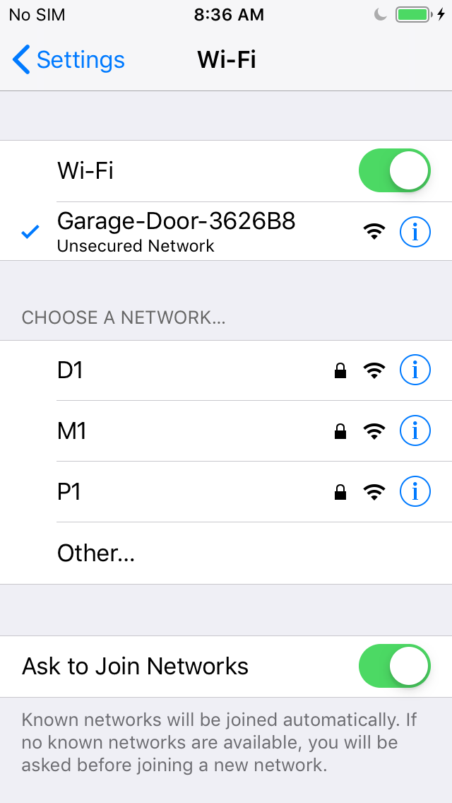
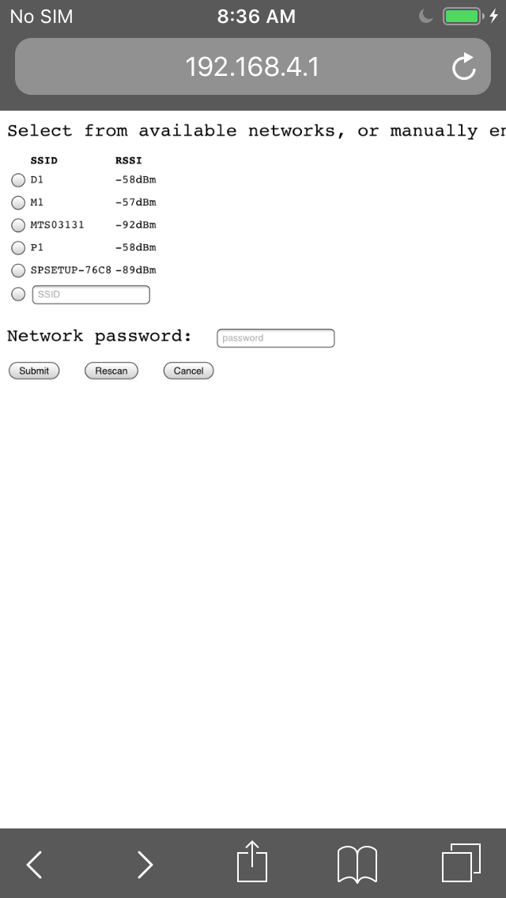

# GRGDO1 RATGDO Homekit Setup Guide

IMPORTANT: If you have a V1 model running v1.0.5 firmware and a ToF sensor please update to v1.1.0 or greater with the local file method.
Download: [homekit-grgdo1-rev1-v1.1.0.firmware.bin](https://github.com/GelidusResearch/homekit-ratgdo32/blob/main/docs/firmware/homekit-grgdo1-rev1-v1.1.0.firmware.bin)

You can run the RATGDO32 HomeKit firmware implementation on a GRGDO1 by using the Gelidus Research Github Repo.
The repo contains the same code as the upstream RATGDO32 Homekit Repo with the exception of hardware pin mappings and device identity labels.
You can also order the GRGDO1 with the HomeKit firmware preloaded.

Note: The firmware is currently in early release. Changes should be expected and we recommend a USB to UART adapter for direct access to the GRGDO1 v1 model.
***The GRGDO1 v2 model includes a USB-C port for flashing.***

**Important information:**

- NEVER connect to a live AC mains supply while the case is open.
- Do not UART flash the firmware while the GRGDO1 is AC connected, use only the USB to UART adapter that supplies 3.3v DC.

## GRGDO1 Device Info

Available from [https://www.gelidus.ca/](https://www.gelidus.ca/)

Inside the enclosure.

- 60 x 60 mm PCB
- 4 Pin ESP programming header (3.3v)
- Powerful ESP32S Dual Core 240Mhz 4MB Flash, BLE and WiFi module!
- PCB layout strictly follows ESP antenna specifications providing excellent WiFi range
- 8 Pin Quick connect
- Flash enable button (power cycle based)
- Powered directly with US AC plug receptacle blades (120 VAC)
- US AC receptacle passthrough plug (120 VAC)
- Follows UL/CSA specifications.
- 1 Meter of 3 conductor 22 AWG bell wire
- 3D printed protective safety enclosure.

Protective 3D enclosure (FR ABS)
The GRGDO1 is only sold with a heavy duty enclosure for your safety.

## GDO HomeKit Setup Guide - Captive portal only connection method.

This method is toolless, all we need is a mobile phone etc. to access the GRGDO1's captive portal.
When the device is in a factory state it will broadcast its captive SSID as Garage Door XXXXXX. Where XXXXXX is the last 6 hex digits of its ESP32 MAC address.

  

  
  

  

Once connected to the SSID simply enter your WiFi network SSID and password. The GRGDO1 will reboot and connect to your network.

## GDO HomeKit Setup Guide - ESP32 WEB Installer method

You can use the GRGDO1 WEB Installer [URL](https://gelidusresearch.github.io/homekit-ratgdo32/flash.html) to install firmware from scratch or configure WiFi using a USB to UART Adapter the v1 model or just use the built in USB-C port on a v2 model.
To enable flash mode on the GRGDO1 you need to depress and hold SW1 then connect your USB to serial adapter to the UART flashing connector as shown here. Once power is applied the button can be released and the GRGDO1 will be in flash mode. (Pre-connecting J1 and then plugging in the USB end is usually easier)
If the GRGDO1 is preloaded with Homekit firmware then it can simply be connected without enabling flash through its Improv enabled feature.

GRGDO1 Flashing/Aux Header

Serial TX and RX pins should be crossed e.g.

<pre><code>J1 PM1 :    USB Adapter
TX     -&gt;   RX
RX     &lt;-   TX
3.3v   -    3.3v Max
GND    -    GND</code></pre>
  

Once a physical connection is set the GRGDO1 is ready to configure, open the URL https://gelidusresearch.github.io/homekit-ratgdo32/flash.html
The connect Button will offer up any physically present USB devices to connect with.
Once connected simply install the HOMEKIT-GRGDO1 firmware.

  

If the Improv feature is detected on preloaded firmware or after flashing.
A Power cycle and 10s boot time is needed after flashing the GRGDO1 v1 ans the v2 will auto reset via the USB-C port.
The installer will offer more options:

  

After connecting to WiFi from this point forward its HomeKit WEB configuration UI will be accessible via http://garage_door_xxxxxx/ or the WEB Installers VISIT DEVICE link.

There is a full readme describing the configuration parameters here https://github.com/GelidusResearch/homekit-ratgdo32/

  

  

## GDO HomeKit Setup Guide - Wiring Security+ v1 and v2.

For the most common supported security+ v1 or v2 GDO's it a simple 3 wire configuration as shown.

  

Additional pin maps can be found here:  [Supported Models](https://github.com/GelidusResearch/device.docs/blob/main/gdo.guides/Supported-Models.md)

## GDO HomeKit Setup Guide - Dry Contact Wiring.

  

This completes the GDO HomeKit Setup Guide.
More to see @ https://www.gelidus.ca
