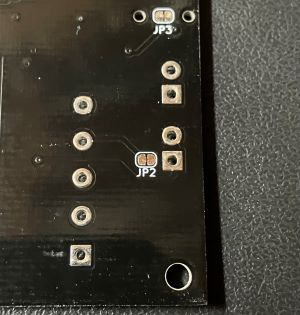
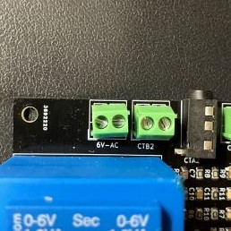
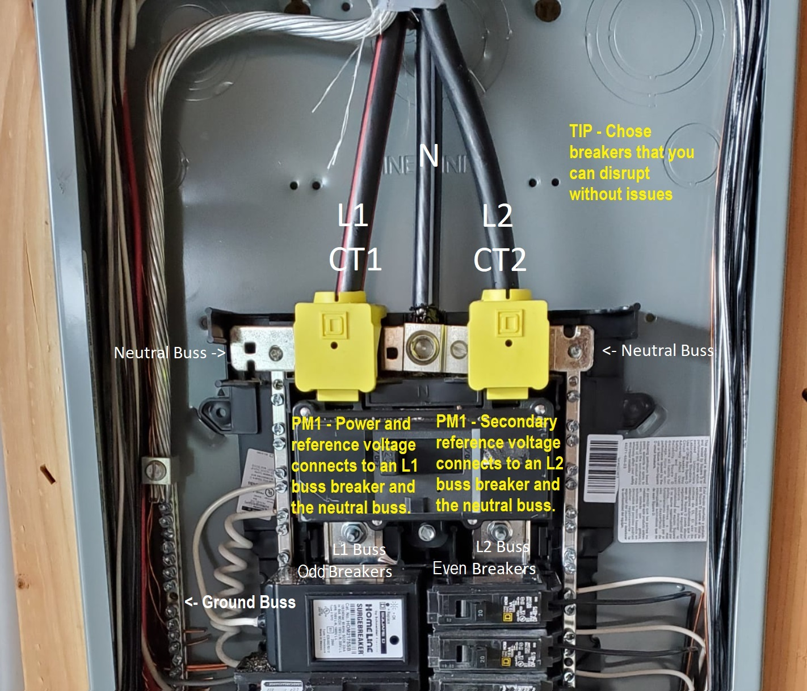

## Installing a Secondary 6VAC Reference Voltage Transformer

Any 120VAC to 6VAC mains connected AC transformer signal can be used as a reference for highly accurate current and phase metering on the PM1.

To use a secondary voltage source JP2 on the PCB must be cut open and the transformer output connects to the 6v-AC input. Polarity only matters if you need to use the phase angle data. If you observe CT1 and CT2 phases are in sync or very close then your 6V-AC inputs need to be swapped.

<div style="display: flex; justify-content: space-between 0;">
    
    
</div>
<br><br>
The PM1RVT120 or PM1RVT120KIT will have a calibration value near 4671
<br><br>
Edit your YAML to match it as follows.

```yaml
  phase_a_current_cal: '15270'
  phase_c_current_cal: '15270'
  phase_a_voltage_cal: '4470'
  phase_c_voltage_cal: '4671'
  ```


## Connecting the PM1 and a secondary transfomer

The PM1 should be supplied from L1 which will start on the first odd numbered breaker and then alternates with L2 on the next odd incremented number. L1 will be referenced from the PM1's on board separate 6VAC transformer winding. If you have a secondary 6VAC reference voltage tranformer then it should be connected to L2 which will be the next odd numbered breaker. The same applies to the even side which starts with L1 and the next even numbered breaker will be on L2.

While this is the most common panel layout it may not be on some rare exceptions, you can verify the correct layout by measuring the voltage across the two odd or two even numbered breakers. It should be always be 240V across the breaker otherwise switch to odd even pair like breakers 5 and 6.

<div style="display: flex; justify-content: space-between 0;">
    
</div>
<br><br>

Once physically connected you can do a measured calibration check using the procedure defined at https://esphome.io/components/sensor/atm90e32 The procedure would adjust for minor component variances. The precalibrated values in the YAML should be within +-1% of actual.