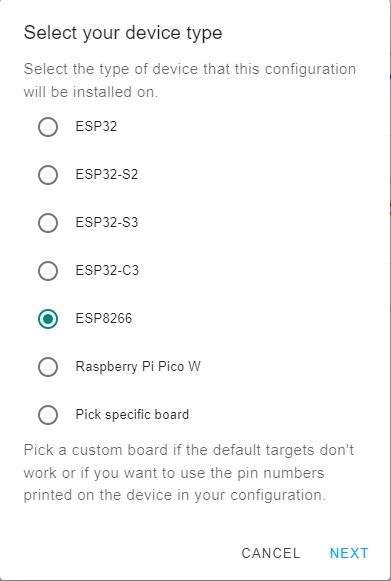

## PM1 Setup Guide

Our PM1 setup guide offers two methods to add the PM1 to an ESPHome/Home Assistant instance. You can add a new device and flash the firmware with a physical device connection via USB serial or you can add it using the pre-installed PM1 WIFI Captive portal and upload the firmware via OTA. The WIFI Captive portal method is by far a more convenient method since we only need a cell phone to establish your local WIFI connection. If the method chosen is the captive portal then you can install PM1 physically in the power distribution panel and configure it remotely using your phone and ESPHome/Home Assistant after one minute of power on time.

**Important information:**

* If you are not familiar with AC mains safety please consult with or hire an electrician to connect the PM1.
* **Never** connect to a live AC mains supply during the install.
* Use only appropriately rated mains connection wire. e.g. 18 AWG Flexible AC 300V cord (Item ACCORD3 in the store)
* Always use a non-metallic fire safe enclosure to house the PM1. (Item PM1BOX1 or PM1BOX2 in the store or 3D print it yourself)
* Do not install the PM1 on the inside of a metal distribution panel as the WIFI signal will be poor due to the shielding.
* Connect CT1 and the AC mains supply to the same same split phase line. (Higher accuracy)
* If you are connecting the optional secondary voltage isolation transformer be sure to cut JP2 and connect the AC mains side to the alternate split AC line. (Polarity is not critical for the secondary voltage monitor)
* CT1 and CT2 will detect current in or out of the panel, if you observe a negative current during positive usage then you need to reverse the clamp direction.

The ESPhome Home Assistant Add-on is required - see: [https://esphome.io/guides/getting_started_hassio.html](https://esphome.io/guides/getting_started_hassio.html)

**Captive portal or Physical USB Serial Method prep:**

1. Open the ESPhome add-on menu and add a new device and enter power-meter-1 or your own convention. The device name must be unique.


2. Skip this step. We need to add a full configuration first.


3. Select the Expressif ESP8266 ESP-12E



4. Skip this step. Note the generated unique key, this must be preserved in the config going forward.


## YAML Edits

* Edit the newly created device named power-meter-1, preserving the api key, add the example PM1 code **after the captive portal line**, as shown.

```yaml
esphome:
  name: power-meter-1

esp8266:
  board: esp12e

# Enable logging
logger:

# Enable Home Assistant API
api:
  encryption:
    key: <your api key>
  ota:
    password: !secret wifi_password

wifi:
  ssid: !secret wifi_ssid
  password: !secret wifi_password

  # Enable fallback hotspot (captive portal) in case wifi connection fails
  ap:
    ssid: power-meter-1
    password: !secret captive_portal_password

captive_portal:

web_server:
  port: 80

spi:
  clk_pin: 14
  miso_pin: 12
  mosi_pin: 13

substitutions:
# Change the disp_name to something you want
  disp_name: PM1
# Interval of how often the power is updated
  update_time: 15s

# Current transformer calibrations:
# 100A/50mA SCT-013 with 2x gain: 15270
# 200A/100mA SCT-023 with 2x gain: 15270
# 120V operation with the Integrated Block AVB 2,0/2/6 Transformer: ~4470
# 120V operation with GRPM1 AC 120/6V Transformer Kit:  ~4610
# 240V operation with the Integrated Block AVB 2,0/2/6 Transformer: ~8940
# 240V operation with GRPM1 AC 240/6V Transformer Kit:  ~9140

  phase_a_current_cal: '15270'
  phase_c_current_cal: '15270'
  phase_a_voltage_cal: '4470'
  phase_c_voltage_cal: '4470'


sensor:

  - platform: wifi_signal
    name: ${disp_name} WiFi Signal
    update_interval: 60s

  - platform: atm90e32
    cs_pin: 5
    phase_a:
      voltage:
        name: ${disp_name} L1 Volts
        accuracy_decimals: 2
      current:
        name: ${disp_name} CT1 Amps
        id: "ct1Amps"
      power:
        name: ${disp_name} CT1 Watts
        accuracy_decimals: 1
        id: "ct1Watts"
      peak_current:
        name: ${disp_name} CT1 Peak Amps
        accuracy_decimals: 2
        id: "ct1PeakAmps"
      phase_angle:
        name: ${disp_name} CT1 Phase Angle
        id: "ct1PhaseAngle"
        accuracy_decimals: 0
      harmonic_power:
        name: ${disp_name} CT1 Harmonic Power
        accuracy_decimals: 2
        id: "ct1HarmonPower"
      gain_voltage: ${phase_a_voltage_cal}
      gain_ct: ${phase_a_current_cal}
    phase_c:
      voltage:
        name: ${disp_name} L2 Volts
        accuracy_decimals: 2
      current:
        name: ${disp_name} CT2 Amps
        id: "ct2Amps"
      power:
        name: ${disp_name} CT2 Watts
        accuracy_decimals: 1
        id: "ct2Watts"
      peak_current:
        name: ${disp_name} CT2 Peak Amps
        accuracy_decimals: 2
        id: "ct2PeakAmps"
      phase_angle:
        name: ${disp_name} CT2 Phase Angle
        id: "ct2PhaseAngle"
        accuracy_decimals: 0
      harmonic_power:
        name: ${disp_name} CT2 Harmonic Power
        accuracy_decimals: 2
        id: "ct2HarmonPower"
      gain_voltage: ${phase_c_voltage_cal}
      gain_ct: ${phase_c_current_cal}
    frequency:
      name: ${disp_name} Freq
    line_frequency: 60Hz
    gain_pga: 2x
    chip_temperature:
      name: ${disp_name} IC Temperature
    update_interval: ${update_time}
  - platform: template
    name: ${disp_name} Total Amps
    id: "totalAmps"
    lambda: return id(ct1Amps).state + id(ct2Amps).state;
    accuracy_decimals: 2
    unit_of_measurement: A
    update_interval: ${update_time}
    device_class: current
  - platform: template
    name: ${disp_name} Total Watts
    id: "totalWatts"
    lambda: return id(ct1Watts).state + id(ct2Watts).state;
    accuracy_decimals: 0
    unit_of_measurement: W
    device_class: power
    update_interval: ${update_time}

  - platform: total_daily_energy
    name: ${disp_name} Total kWh
    power_id: totalWatts
    filters:
      - multiply: 0.001
    unit_of_measurement: kWh
    device_class: energy
    state_class: total_increasing

time:
  - platform: sntp
    id: sntp_time
    servers: <Your Time Server>

switch:
  - platform: restart
    name: ${disp_name} Restart
```

**Captive Portal Method:**

1. With the PM1 already powered up for at least 1 minute use a phone or other capable device connect to the PM1 default preinstalled captive portal AP SSID named power-meter-10


2. Set the SSID and Password.


After a minute or so visit the PM1 WEB portal using its mDNS address to verify it’s ready. Power cycle it if required.

http://power-meter-1.local

From your HA ESPHome Dashboard, prepare your edited YAML firmware config by selecting INSTALL on the top right of the ESPHome edit screen.

3. Select wirelessly.

