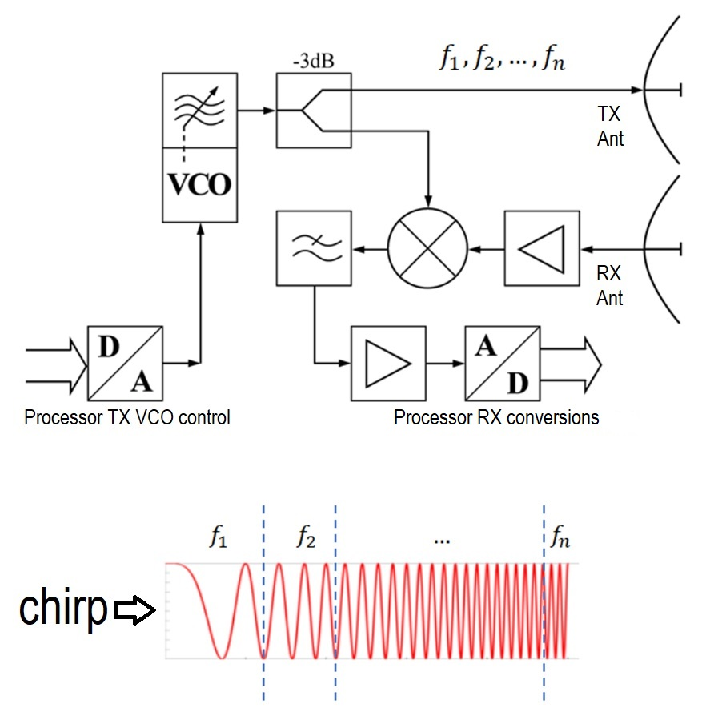

**Welcome to the Gelidus Research PS1 mmWave Radar Tuning Guide - LD2420**

**Operation Description - Technical**

The LD2420 module is composed of two key components: a radar transmitter/receiver IC (SK3M1110) and a Cortex microprocessor IC (PY32F003F17). The radar IC is configured by the processor to emit 24 GHz frequency-modulated continuous wave (FMCW) signals. These emissions contain a distinctive pattern, referred to as a chirp.

A chirp starts at an initial frequency and increases linearly over a predefined time by adjusting the voltage of a voltage-controlled oscillator (VCO). The chirps are transmitted continuously at set intervals, known as a beat. For each chirp, the processor records its start time before it propagates from the antenna.

When a reflected signal is received by the Rx antenna within a beat period, the processor calculates the chirp trip time by converting the received signal back to a voltage. This yields the travel time, derived from the chirp's frequency-to-voltage characteristics. The minimum and maximum usable travel times of the chirps define the module's detection range in meters.

To determine the range of a detected target, the processor compares the reflected chirp's trip time with the start time. The result is stored in one of 16 predefined time value gates, each representing a 0.7-meter range window. Alongside the chirp's travel time, the signal amplitude is also recorded for each time gate.

These two data elements of range (trip time) and presence (amplitude) are continuously processed. If a reflected chirp is detected, the processor activates a presence time window countdown timer, and the presence logic is set true both on the OT1 pin and via serial command data transmission. Any changes in the reflected chirp's amplitude or trip time that exceed the tuning thresholds during this window restarts the presence timer, maintaining the presence true state. If the timer countdown expires with no detections, the presence state will be set to false.

The processor logic also accepts a single range of gates for monitoring, starting at gate 0 and ending at gate 15, for a usable range of 11.2 meters. The range is selectable using a minimum and maximum input value. Real-world tests found that a 9-meter range is stable; beyond that yielded some instability.

**mmWave Transmitter/Receiver illustration**
 

 

# Basic Tuning

**General Behavior**

Editing any of the tuning values is not saved until the Apply Config button is activated. This gives you the ability to set them without constantly applying them. You can also revert any value edits to the previous state by using the "Abort Edits" button. Calibration sensitivity factor settings are not persistent and will revert to the defaults after a reboot.

Note:
Frequent persistent writes to the module's non-volatile memory may cause the module to behave abnormally. If this occurs, a power cycle will correct it.

**Calibration**

The PS1 features a noise floor calibration function. Calibration must only be run when no target objects are in the FMCW field. This also applies to any object that may be beyond a wall or floor since the FMCW emissions can pass through them. This requirement applies regardless of any minimum or maximum range setting within the component. The calibration function will tune the full range whether enabled or not. Calibration also solves non-object-based triggers such as a microwave oven or other inductive electrical noise sources. If false triggers are occurring using the default calibration value, you can adjust the sensitivity factor tuning control. This control applies a multiplier value to control the gate calibration threshold. The threshold is based on Hylink's preset value and is augmented to a range derived from real-world testing.

Tip: If you have an object like a fan or other variable source in the target field you can try running calibration while it moves to capture a noise level for its reflected signal. This also applies to possible targets on the other side of a wall or floor. You can also manually tune for them but its much easier to know the actual sampled noise level.

**Tuning Controls**

- Calibration Move and Still Sensitivity Factors
  + Setting the move or still sensitivity factor value higher will result in lower sensitivity by applying higher threshold values above the noise floor.
  + Setting the move or still sensitivity factor value lower increases sensitivity by setting the threshold very close to the noise floor.
  + After a desired factor value is set, you can run calibration by setting the component into calibration mode from the mode select box. After starting a calibration, it should be run for at least 60 seconds and be committed by pressing the Apply Config button. Changing the mode without applying the config will abort the calibration. Once committed, the calibration values will persist in the module's non-volatile flash memory.
  + Once a calibration is started you can observe it's noise floor data from the output logs in the ESPHome dashboard (recommended) or the WEB UI.
 

- Detection Presence Timeout
  + When a move or still presence threshold value is crossed by a received chirp signal the detection presence timer will start counting down in seconds from the value setting of this control.
 

- Detection Gate Maximum
  + Sets the maximum sensing gate number for move and still activity. Lowering this prevents detection past that gate.
 

- Detection Gate Minimum
  + Sets the minimum sensing gate number for move and still activity – recommended minimum is 1 or 2 to avoid false positives from behind and near the sensor.
 

- Gate Distance Helpers
  + To estimate a gate number distances in feet use:  0.7m * gate number * 3.3
  + To find a gate number using feet use:  estimated feet / 3.3 / 0.7 then round to nearest integer.

In addition to the auto-calibration capability, you can also manually edit each of the 16 move and still gate thresholds for finer tuning or specific overrides.

There are two control formats within the YAML configuration: compact and full edit mode. The format is automatically set to compact mode when the select gate number control is added to the YAML file. If the select gate is defined, other individual inputs will be ignored and not presented as a control. See the ESPHome Documentation for full details of the configurations.

**Select Gate to Set - Compact Mode**

 - Select Gate to Set
   + This input value sets the specific gate number to be manually edited. While the gate number is selected any changes to move and still thresholds will be updated when the Apply Config button if pressed. You can edit any number of gates and the values will all be applied.

 **All Threshold Gate Edit Mode**
 - Full Gate Edit Mode
   + When in the full gate edit mode you can directly edit and observe all gate move and still threshold values.

**General Sensor Placement Rules**

The LD2420 mmWave sensor signals will pass through most walls and floors, so in general, you want to limit the gate range within the target room. When possible, the ideal placement of an LD2420 sensor is on the ceiling. In real-world tests, wall plugs were found to be very effective in bathrooms and living rooms. Living room targets are often seated and closer to wall plug levels.

Placement proximity and direction are very important for false positive avoidance. It is critical that sensors are not in overlapping ranges of each other and especially not facing each other. Failure to follow this rule will certainly result in false positive triggers. If sensors face each other, there is no way to tune them, and setting gate limits will not mitigate this problem. The signal is no longer a reflection; thus, they will measure each other's chirp transmissions.

Electrical noise in close proximity is also a potential false positive trigger, especially from microwave ovens and switched high-current inductive loads like a heater.

Finally, walls that are oddly shaped or angled close to the mmWave sensor can trigger false positives via secondary reflections. This can be mitigated by reducing the range, keeping the longer secondary reflections out of the gate time measurements.

[Gelidus Research - Products ](https://www.gelidus.ca)